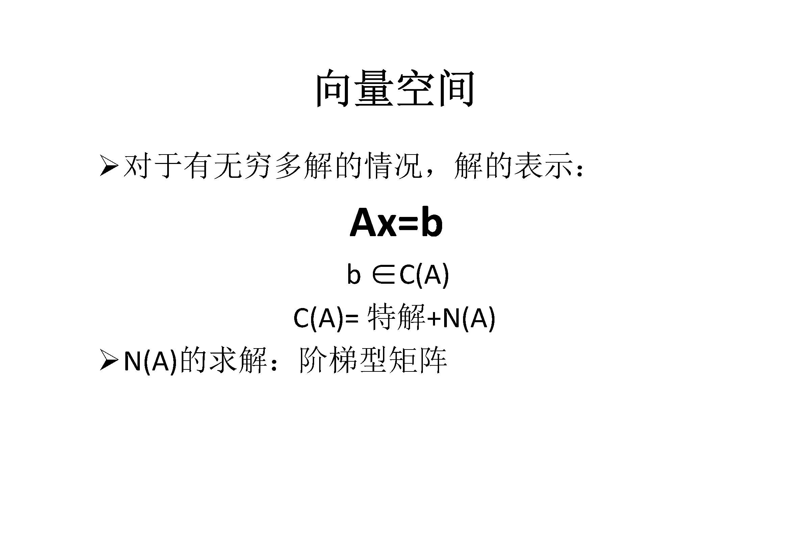
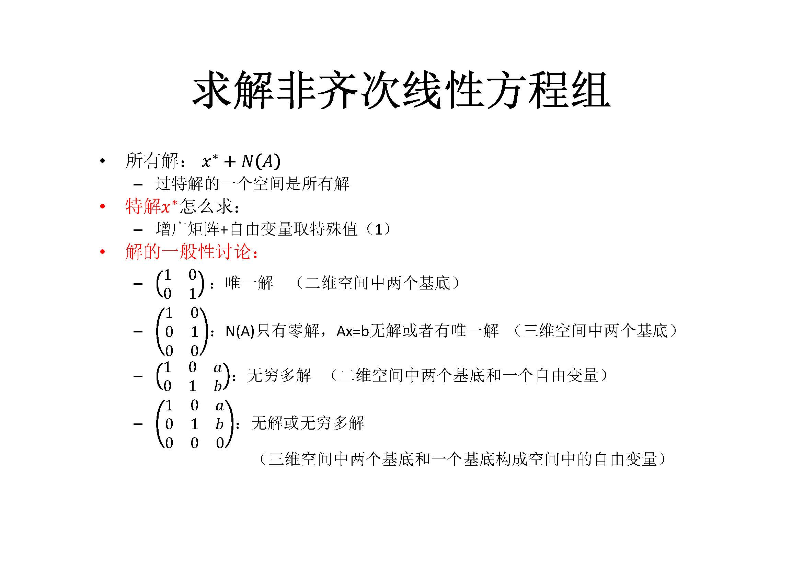

【[Home](https://simplelp.github.io/) | [GitHub](https://github.com/SimpleLP/LinearAlgebra)】         
本系列文章归纳整理线性代数与矩阵理论相关内容，线性代数的核心是求解线性方程组，矩阵是进行计算的很有用的工具

---------------------------------------------------------------------

# 第一部分：线性方程组的表示与矩阵求逆
提纲 
 

## 1. 向量及其运算
提纲 
 
PDF笔记：[第一讲_向量及其运算](第一讲_向量及其运算.pdf)

## 2. 矩阵与线性方程组
提纲 
 
PDF笔记：[第二讲_矩阵与线性方程组](第二讲_矩阵与线性方程组.pdf)

## 3. 高斯消元法
提纲 
 
PDF笔记：[第三讲_高斯消元法](第三讲_高斯消元法.pdf)

## 4. 矩阵运算
提纲 
 
PDF笔记：[第四讲_矩阵运算](第四讲_矩阵运算.pdf)

## 5. 矩阵的逆
提纲 
 
PDF笔记：[第五讲_矩阵的逆](第五讲_矩阵的逆.pdf)

## 6. LU分解
提纲 
 
PDF笔记：[第六讲_LU分解](第六讲_LU分解.pdf)

# 第二部分：线性方程组解的分析与求解

## 7. 向量空间
提纲 
 
PDF笔记：[第七讲_向量空间](第七讲_向量空间.pdf)

## 8. 求解齐次线性方程组
提纲 
 
PDF笔记：[第八讲_求解齐次线性方程组](第八讲_求解齐次线性方程组.pdf)

## 9. 第九讲_求解非齐次线性方程组
提纲 
  
PDF笔记：[第九讲_求解非齐次线性方程组](第九讲_求解非齐次线性方程组.pdf)

-----------------------------------------------

# 参考资料
[清华大学线性代数（上）](http://www.xuetangx.com/courses/course-v1:TsinghuaX+10421094X_2015_2+sp/about)       
[清华大学线性代数（下）](http://www.xuetangx.com/courses/course-v1:TsinghuaX+10421102x_2015_T2+sp/about)     
[理解矩阵—孟岩](https://blog.csdn.net/myan/article/details/647511)       
[超详细MIT线性代数公开课笔记(上中下)](https://wenku.baidu.com/view/daac42a977eeaeaad1f34693daef5ef7ba0d129a.html)      
[MIT 线性代数 （公开课）](http://open.163.com/special/opencourse/daishu.html)    
[Introduction to Linear Algebra, Fifth Edition](http://math.mit.edu/~gs/linearalgebra/)      
